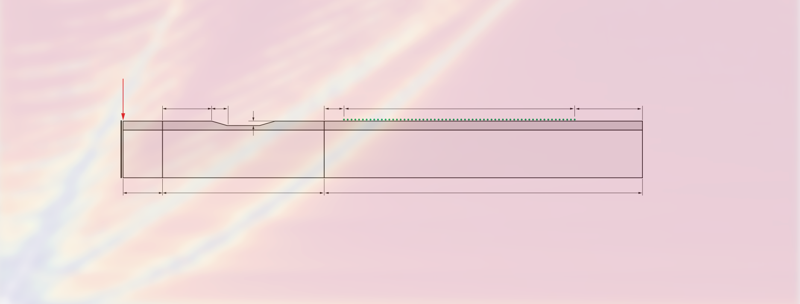

# [Wave Inversion with Machine and Deep Learning](https://ssrn.com/abstract=4124083)

**Author:** [Maximilian Schmitz](https://sjmxschm.github.io/) @ Georgia Institute of Technology

**Email:** [mschmitz7@gatech.edu](mailto:mschmitz7@gatech.edu)

## Introduction

This is the official repository of the publication
> Schmitz, Maximilian and Kim, Jin-Yeon and Jacobs, Laurence J., Machine and Deep Learning for Coating Thickness 
> Prediction Using Lamb Waves. Available at SSRN: https://ssrn.com/abstract=4124083 or 
> http://dx.doi.org/10.2139/ssrn.4124083

With this repository, you can
- convert phase speed - frequency representations into the frequency - wave number domain
- automatically simulate CAE models for finite element analysis in [Abaqus](https://www.3ds.com/products-services/simulia/products/abaqus/) 
- invert to the thickness of the coating using machine learning techniques
- invert to the uniformness of the coating using deep learning

## Repository Walk through

The project is subdivided into 3 separate main parts. Each part is contained in a
separate folder with respective naming which will be walked through in the following.

- `analysis_sklearn` contains the machine learning inversion procedure based on Scikit-Learn
- `analysis_disp_curves` incorporates the conversion of dispersion curves extracted from a 
dispersion curve calculator (like [DLR dispersion calculator](https://www.dlr.de/zlp/en/desktopdefault.aspx/tabid-14332/24874_read-61142/))
into the right format and domain, e.g. from a phase speed - frequency representation into a
frequency - wave number domain. 
- `create_model` includes all scripts and files to (1) create the CAE model with a Python script in [Abaqus](https://www.3ds.com/products-services/simulia/products/abaqus/)
(industry standard for finite element analysis (FEM)) and (2) to run the entire pipeline for creating several
simulations on a Linux system (like the Georgia Tech PACE cluster) in parallel. More detailed
information about how to use those scripts properly and how to install the respective
environment can be found in the `README.md` in the respective folder.
- `dl_code` contains the code and data for training and evaluating a deep learning based
inversion model. The folder contains several notebooks which are explained in the `README.md`.
- `extract_disp_history` is merged into the `create_model` folder and is not needed anymore
- `helper_scripts` include smaller scripts for minor tasks used during develpment
- `unit_tests` include Python unit tests which were run during development and can still be
used for testing any adjustments made. Most unit tests are called form the deep learning code.
